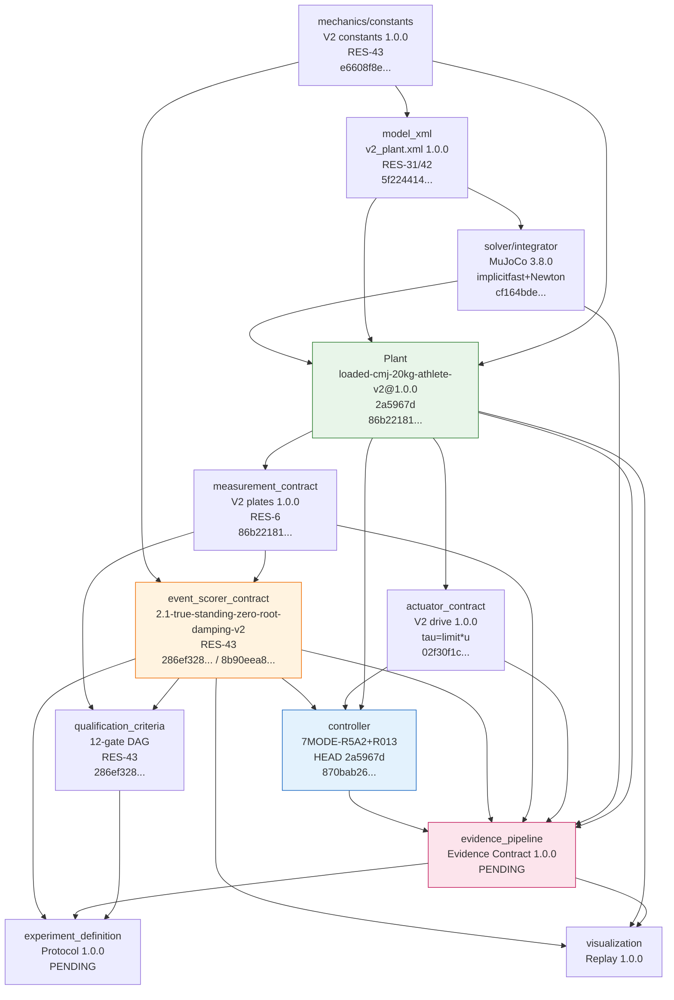

# Authority Graph — Loaded CMJ MuJoCo

**Version:** 1.0.0  
**Date:** 2026-09-03  
**Ledger:** `AUTHORITY_LEDGER.json`  
**Mermaid:** rendered below; source-of-truth is the ledger JSON



---

## 2. Version Flow (supersession)

```
V1 loaded-cmj-model-1 (archived)
  └─► V2 baseline (fffb98e) — first sagittal-dominant 10-body, limited root, damping
       └─► V2.1 honest fall (6f03dad) — remove root_tz limit, add 6 fall shells
            └─► V2.1 honest limits (fa2a8f6 / RES-31) — remove root_tx/ry limits, prove MATERIAL_SUPPORT
                 └─► V2.1 zero damping (8708829 / RES-42) — root damping 10,10,5 → 0, requalify standing FAIL old envelope
                      └─► V2.1 true-standing rebase (9d97bc5 / RES-43) — new envelope 2.1-true-standing-zero-root-damping-v2, 15200 samples
                           └─► V2.1 honest launch (3995967 / RES10_R5A2) — 16-param SUPPORTED residual, honest flight E1-E8
                                └─► V2.1 honest landing capture (2a5967d / HEAD) — IMPACT 190/Kd20, CAPTURE standing, E10 0.827 / E11 0.977

Event scorer: 2.1-true-standing-recovery-v1 (01e89ac0) ──RES-42 invalidates──► 2.1-true-standing-zero-root-damping-v2 (8b90eea8) [current]

Evidence: ad-hoc receipts ──this rebase──► Evidence Contract 1.0.0 (deterministic bundle, manifest hash binding)
```

---

## 3. Dependency Table

| Authority | Depends on | Reason |
|---|---|---|
| `model_xml` | `mechanics/constants` | `constants.py` documents XML identity, horizon, solref, limits |
| `solver/integrator` | `model_xml` | `option` timestep/integrator/solver lives in XML |
| `Plant` | `model_xml`, `mechanics/constants`, `solver/integrator` | Plant compiles XML, asserts `nq10 nv10` vs constants, uses solver |
| `actuator_contract` | `Plant` | Limits index physical actuators compiled by Plant |
| `measurement_contract` | `Plant`, `model_xml` | Foot geoms, floor, `foot_contact_summary` need compiled model |
| `event_scorer_contract` | `measurement_contract`, `mechanics/constants` | Events consume `summary` + thresholds, COP, support margin |
| `qualification_criteria` | `event_scorer_contract`, `measurement_contract` | Gates are event DAG + plate thresholds |
| `controller` | `Plant`, `actuator_contract`, `event_scorer_contract` | `act(obs)→u→tau` validated against Plant limits, timed against event frontier |
| `experiment_definition` | `qualification_criteria`, `event_scorer_contract`, `evidence_pipeline` | Predeclared gates + evidence schema |
| `evidence_pipeline` | `Plant`, `solver/integrator`, `actuator_contract`, `measurement_contract`, `event_scorer_contract`, `controller` | Bundle hashes every layer |
| `visualization` | `evidence_pipeline`, `Plant`, `event_scorer_contract` | Replay consumes sealed trace + event records |

No cycles. Controller never appears upstream of Plant/solver/measurement/event.

---

## 4. Known Cross-Cutting Caveats

- **Not human-validated:** entire graph is CS-qualification; no model-validation edge exists (no referent dataset).
- **MuJoCo version sensitivity:** absolute event times shift (3.1→3.8) but pre-limit equivalence (`0.0` diff before first root-limit row) is the invariant that proves mechanical correction without hidden physics change.
- **Standing envelope:** expanded by exactly 1 ULP (`nextafter`) — not an arbitrary factor — and tied to 15200-sample median window `[0.100125,2.0]`.
- **Evidence repository is non-Git:** history is by bundle hash + `FINAL_RECEIPT.md`, not by Git log.
